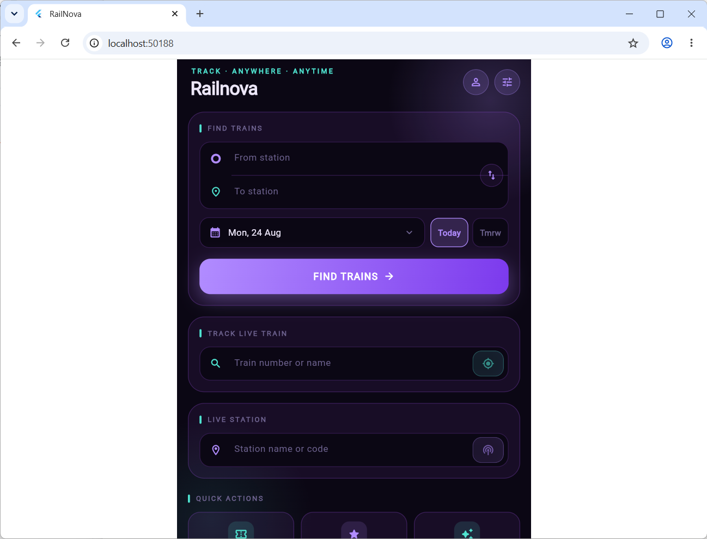
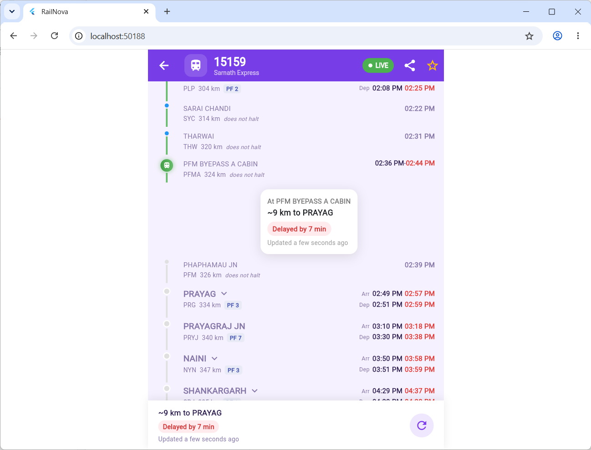
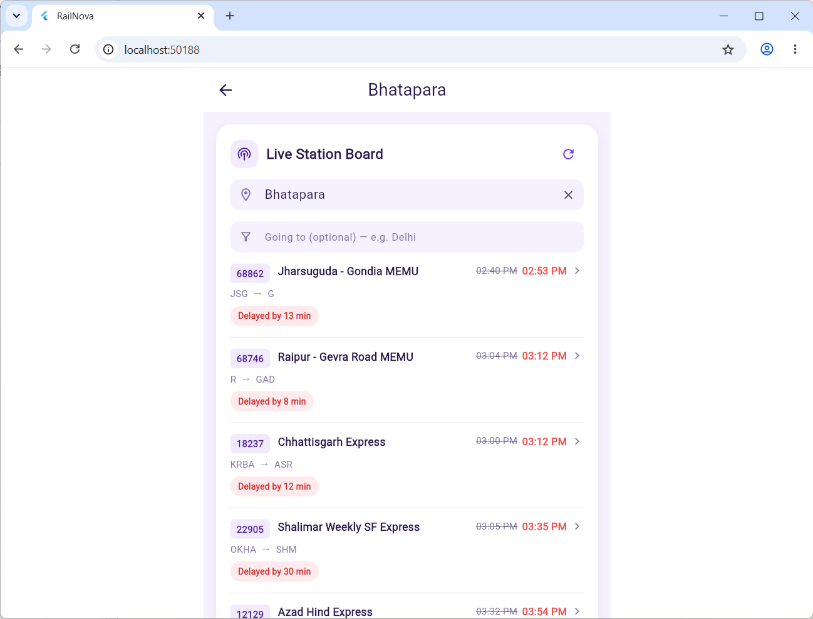
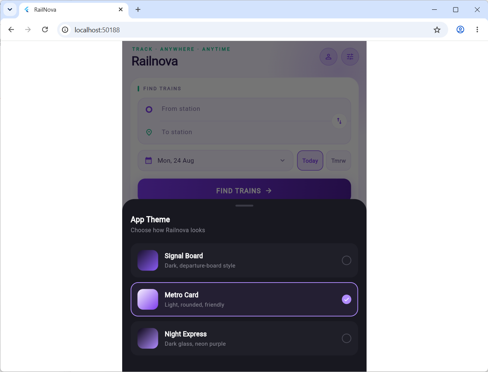
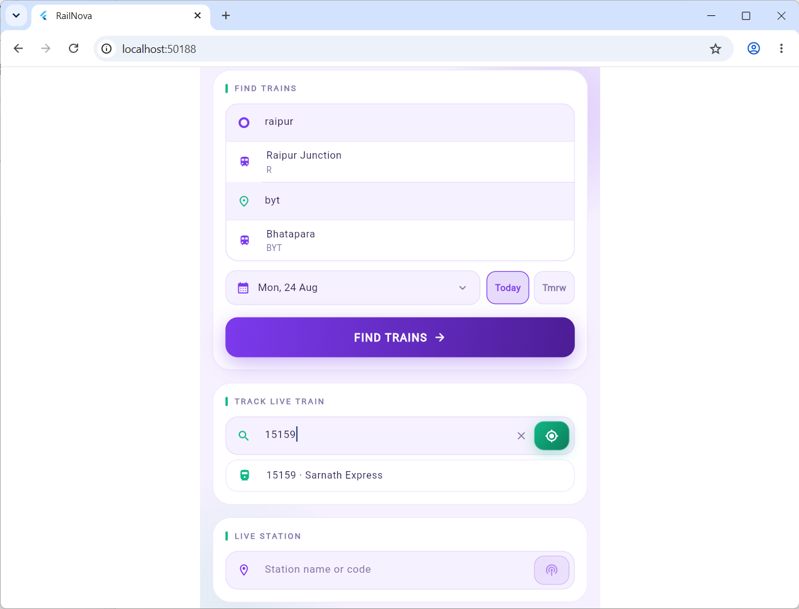
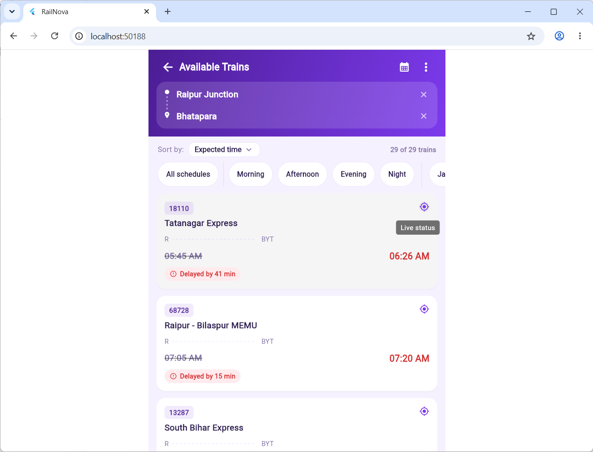
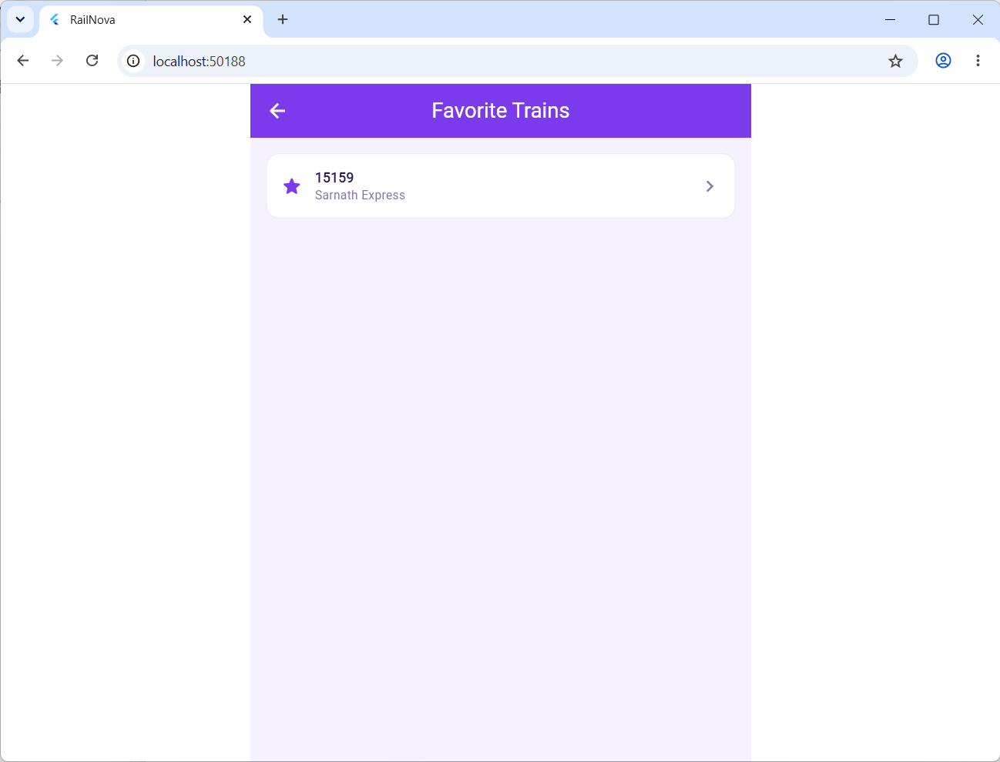
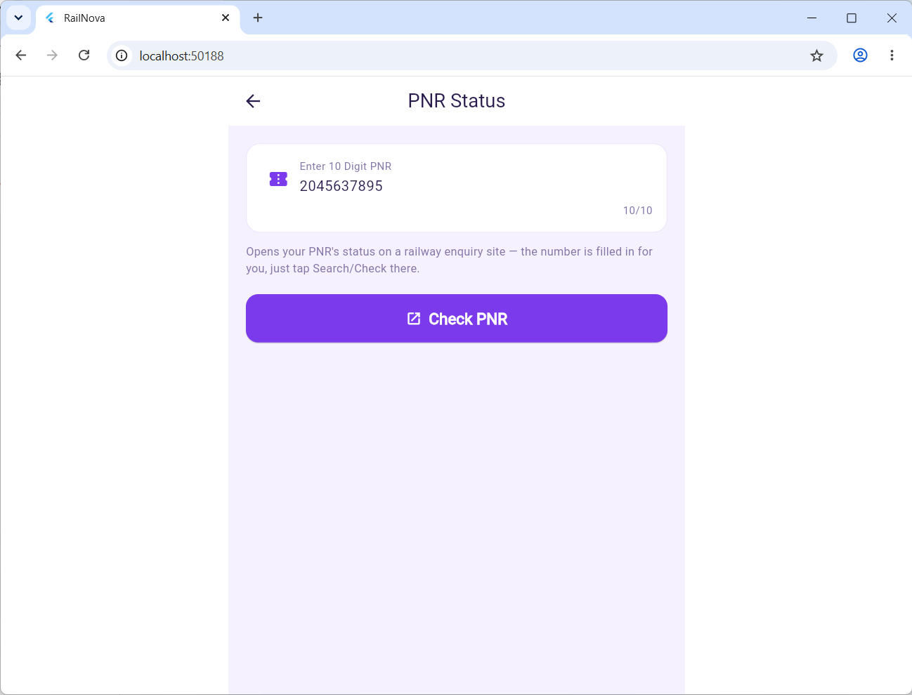
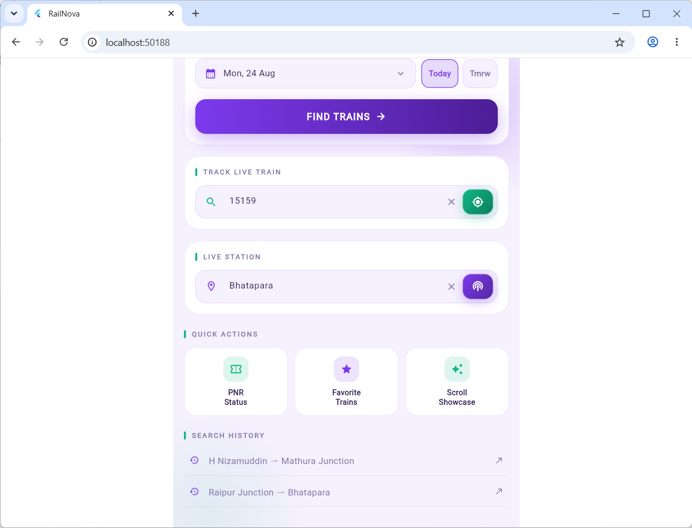

# RailNova

**Track • Anywhere • Anytime**

A modern Flutter app for live Indian Railways train tracking — real-time position updates, station boards, PNR status lookup, and favourite trains management — powered by the [RailRadar](https://railradar.in/docs) API.





## Features

### 🚂 Live Train Tracking
- **Real-time position tracking** with station-by-station route timeline
- **Auto-refresh every 30 seconds** while journey is in progress
- **Exact distance calculation** to next station (no interpolation guessing)
- **Delay formatting** — shows delays as "2h 48m" instead of raw "168 min" (caught real bug here)

### 🏛️ Live Station Board
- **Real-time arrivals/departures** for any Indian Railway station
- **Directional filtering** — "Going to X" filter only shows trains genuinely travelling in that direction (not reverse-direction trains that touch both stations)
- **Live delay updates** with visual indicators
- **Platform & coach information** when available

### 🎫 PNR Status Lookup
- Quick booking confirmation and seat status check
- Links directly to railway enquiry sites for full details

### ⭐ Favorite Trains
- Save frequently tracked trains for one-tap access
- Persistent storage with local caching

### 🔔 Push Notifications
- Real-time delay alerts for tracked/favourite trains
- Firebase Cloud Messaging integration

### 🎨 Multiple Themes
- **Signal Board** — Dark, departure-board style
- **Metro Card** — Light, rounded, friendly
- **Night Express** — Dark glass, neon purple
- Status bar automatically adjusts brightness for readability

## Tech Stack

- **Frontend:** Flutter (Android, iOS, Web, Windows, macOS, Linux)
- **State Management:** Provider
- **API:** REST — RailRadar live train & station data
- **Backend Services:** Firebase (Analytics, Crashlytics, Cloud Messaging)
- **Local Storage:** SharedPreferences (recent searches, favourites)
- **Testing:** Dart unit tests (delay formatting utility)

## Screenshots

### Home Screen & Themes




### Live Train Features



### Additional Screens





## Project Structure

```
lib/
  core/
    config/            # API base URL, timeouts
    constants/         # App-wide constants
    navigation/        # Route transitions
    theme/             # Skins & design tokens (3 themes)
    utils/             # Shared, unit-tested helpers (format.dart)
    widgets/           # Reusable components (route timeline, station board)
  features/
    home/              # Landing screen, quick actions
    live/              # Live train tracking with 30s auto-refresh
    pnr/               # PNR status lookup
    search/            # Train search between stations
    station_board/     # Live station board with directional filtering
    train_details/     # Static train schedule details
    train_list/        # Search results list
    favorite_trains/   # Saved trains quick access
  models/              # API response models (Train, Station)
  providers/           # App-wide state (theme provider)
  services/            # HTTP client, notifications, storage
test/
  core/utils/          # Unit tests for delay formatting (5/5 passing)
```

## Getting Started

### Prerequisites

- [Flutter SDK](https://docs.flutter.dev/get-started/install) (stable channel)
- A Firebase project (optional; app runs without it, just without notifications)

### Setup

1. **Clone & install:**
   ```bash
   git clone https://github.com/Adarshtiwari0/railnova.git
   cd railnova
   flutter pub get
   ```

2. **Firebase setup** (optional but recommended):
   - Install [FlutterFire CLI](https://firebase.google.com/docs/flutter/setup)
   - Run `flutterfire configure` against your Firebase project
   - Or manually download `google-services.json` (Android) and `GoogleService-Info.plist` (iOS) from Firebase Console and place them in `android/app/` and `ios/Runner/` respectively

3. **Run:**
   ```bash
   flutter run
   ```

### Running Tests

```bash
flutter test
```

All 5 formatDelay tests pass ✅

## Architecture Highlights

### Race Condition Fix
Live data polling carries a request sequence number — if a slower response (e.g. from an older date/station switch) arrives after a newer one, it's automatically discarded. Prevents stale data from silently overwriting fresh data on screen.

### Delay Formatting
Consolidated into a single, unit-tested utility (`lib/core/utils/format.dart`). Every screen that shows delays uses it — prevents the raw "168 min" bug from ever happening again:
- < 60 min: "45 min"
- ≥ 60 min: "2h 48m" or "3h" (clean output)

### Distance Calculation
Fixed an interpolation bug where trains at non-halt stations showed wildly inaccurate remaining distances. Now reads the current station's own distance from the route data instead of interpolating between previous/next halts.

### Station Board Direction Filter
Sequence-based validation: trains only appear in "Going to X" results if their sequence at the current station is *before* their sequence at the destination station — catches reverse-direction trains that share both stations on separate legs.

## Known Gaps

- Only core utilities have unit tests; widget-level tests would be next
- App icon still default Flutter icon (quick to replace with `flutter_launcher_icons`)

## License

Open source — feel free to fork, modify, learn

## Repositories

- **Frontend:** [github.com/Adarshtiwari0/railnova](https://github.com/Adarshtiwari0/railnova)
- **Backend:** [github.com/Adarshtiwari0/railnova-backend](https://github.com/Adarshtiwari0/railnova-backend) (Node.js/Express API server)

---

[](https://github.com/Adarshtiwari0/Railnova/releases/latest)

Built with ❤️ for Indian Railways enthusiasts and commuters.
